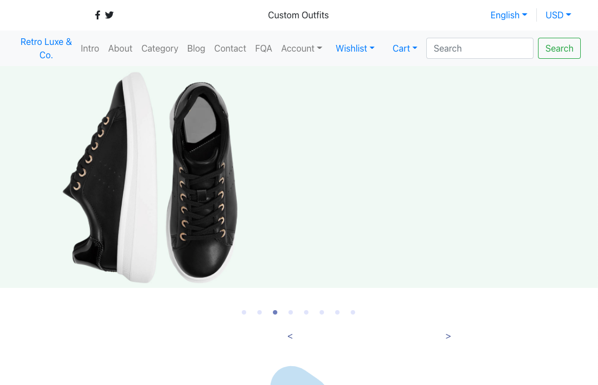
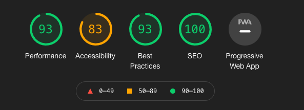
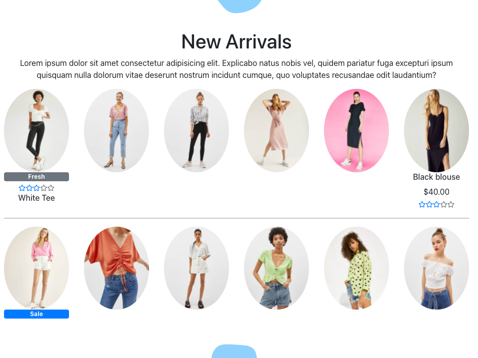
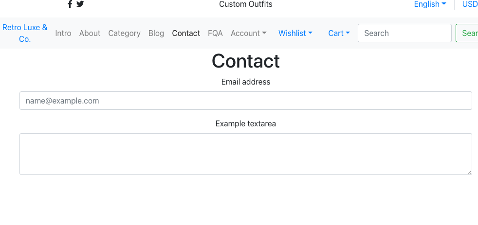
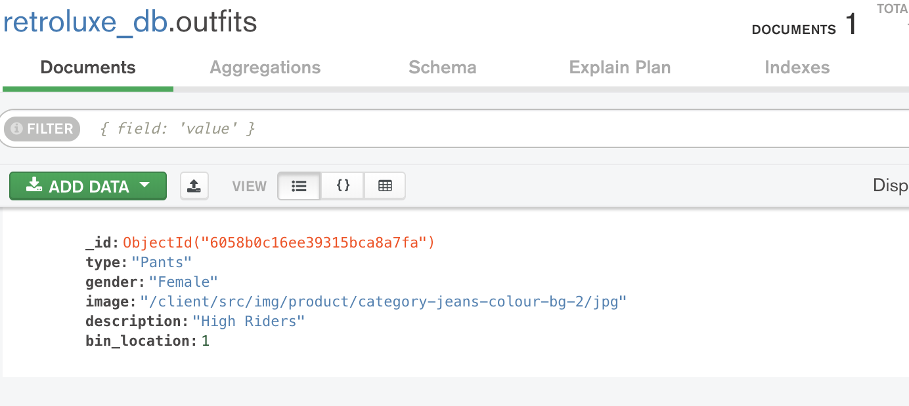
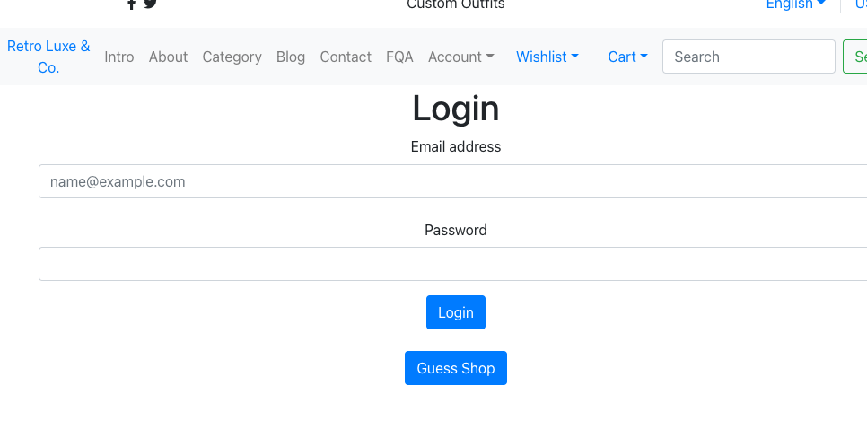
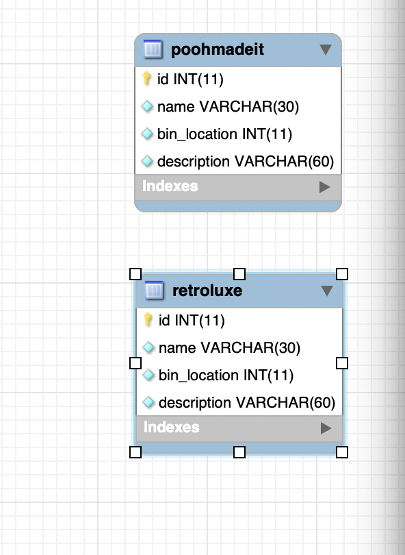

# RetroLuxe-Co.LLC

At the moment, Retro Luxe is on hold for company reasons. Hopefully they will get back up and running soon.

Retro Luxe &amp; Co. LLC
</br>
[🎧 Website 🎧](https://retroluxesite.herokuapp.com/)
[🔭 Repo 🔭](https://github.com/dagreatcode/RetroLuxe-Co.LLC)



</br>

npm audit fix --force
"start": "react-scripts --openssl-legacy-provider start"
npm i react-scripts@latest

[](https://retroluxesite.herokuapp.com/)
</br>

## Table of Contents

#### &nbsp;&nbsp;&nbsp;&nbsp;[1)&nbsp;Introduction](#introduction)

#### &nbsp;&nbsp;&nbsp;&nbsp;[2)&nbsp;Description](#description)

#### &nbsp;&nbsp;&nbsp;&nbsp;[3)&nbsp;Features](#features)

#### &nbsp;&nbsp;&nbsp;&nbsp;[7)&nbsp;Review](#review)

#### &nbsp;&nbsp;&nbsp;&nbsp;[4)&nbsp;Usage](#usage)

#### &nbsp;&nbsp;&nbsp;&nbsp;[5)&nbsp;Contributing](#contributing)

#### &nbsp;&nbsp;&nbsp;&nbsp;[6)&nbsp;License](#license)

#### &nbsp;&nbsp;&nbsp;&nbsp;[7)&nbsp;Questions](#questions)

## Introduction

A full-stack MERN application utilizing MongoDB, Express, React, and NodeJS, the four technologies that make up the stack.

The app also had to be responsive.


## Description

A Retro Clothing Website


## User Story

Our user story is as follows:
```
--AS A: Person that loves retro clothing, but can not find any anywhere.
--I WANT: A site retro website
--SO THAT: I can buy or get custom retro items the way I have always dreamed of.
```

## Acceptance Criteria

```
GIVEN I want a custom retro outfit made
WHEN I click customs
THEN I am presented with options
WHEN prompted to chose what type
THEN I fill out the form and wait to be contacted.
```

One aspect of this project that makes it stand out is when you come to this site, you get a 1 on 1 interview on the items you want custom made from old to new. Thats why it is named Retro Luxe™.

## Features

Twilio:


For conformation to the customers cell phone.

</br>
MongoDB:


For inventory and user data.

</br>
JSON Web Token(JWT):


Verification of password and user.

## Review

## Usage

The URL for this application will soon be [http://www.retroluxe.com].

But for now, the Heroku link for this application is [https://retroluxesite.herokuapp.com/].

I started off without react to use SQL. But using MongoDB in this case might be a better choice for the cause.


## Contributing

Retro Luxe Collaborators:

Vincent Kendrick: [https://github.com/dagreatcode].

## License

---

[](https://github.com/dagreatcode/RetroLuxe-Co.LLC/blob/main/LICENSE)

Permission is hereby granted, free of charge, to any person obtaining a copy
of this software and associated documentation files (the "Software"), to deal
in the Software without restriction, including without limitation the rights
to use, copy, modify, merge, publish, distribute, sublicense, and/or sell
copies of the Software, and to permit persons to whom the Software is
furnished to do so, subject to the following conditions:

The below copyright notice and this permission notice shall be included in all
copies or substantial portions of the Software.

THE SOFTWARE IS PROVIDED "AS IS", WITHOUT WARRANTY OF ANY KIND, EXPRESS OR
IMPLIED, INCLUDING BUT NOT LIMITED TO THE WARRANTIES OF MERCHANTABILITY,
FITNESS FOR A PARTICULAR PURPOSE AND NONINFRINGEMENT. IN NO EVENT SHALL THE
AUTHORS OR COPYRIGHT HOLDERS BE LIABLE FOR ANY CLAIM, DAMAGES OR OTHER
LIABILITY, WHETHER IN AN ACTION OF CONTRACT, TORT OR OTHERWISE, ARISING FROM,
OUT OF OR IN CONNECTION WITH THE SOFTWARE OR THE USE OR OTHER DEALINGS IN THE
SOFTWARE.

---

## Questions

For questions or for other developers who would like to provide feedback on how to improve the work done on this project or offer other suggestions, please feel free to do so via the GitHub repositories provided.


&copy; 2021 Vincent Kendrick
